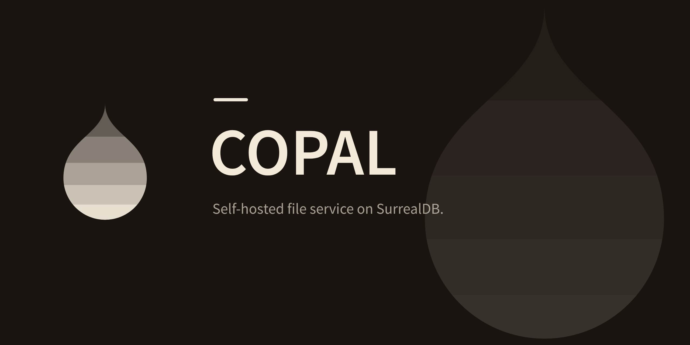

<p align="center">
  
</p>

<p align="center">
  <a href="LICENSE"></a>
  
  
</p>

Copal is a file service you run on your own infrastructure. Your
applications upload files to it, and Copal stores them, checks them,
indexes their text, and serves them back to whoever is allowed to read
them. It keeps every version, can share a file through an expiring link,
and speaks REST, GraphQL, S3, and MCP, so a web app and an AI agent can
work with the same files.

Everything Copal knows about a file (metadata, permissions, search index,
version history, processing state) lives in SurrealDB, in one
transactional database. The bytes go to local disk or to object storage,
encrypted at rest when you give Copal a key.

## Features

- **Uploads.** Stream a file in with a single `PUT`, resume large uploads
  over [tus](https://tus.io), or have Copal fetch a URL for you. Copal
  verifies each upload's digest and stores identical content once.
- **Processing.** Every upload runs through a durable pipeline that
  survives restarts: content-type sniffing, a blocked-extension policy,
  an optional ClamAV scan, text extraction, and optional embeddings. A file
  that fails a check is quarantined. On request, Copal renders image
  thumbnails or hands a file to your own transformer service (for example
  one running ffmpeg) and stores the result.
- **Search.** Full-text search over extracted text, with semantic and
  hybrid search when you connect an embedding model. Copal reads text and
  JSON itself; other formats need a Tika-compatible extractor.
- **Versions and retention.** Every upload becomes a new version, and old
  versions stay readable. Retention rules and legal holds keep versions
  from being deleted early.
- **Sharing and access.** Signed links with an expiry and a use limit that
  you can revoke. Per-file access levels (`public`, `private`, `tenant`,
  `grant`). API keys scoped to `read`, `write`, or `admin`, and principals
  for people, services, and agents.
- **Storage.** Local disk by default, plus S3, Google Cloud Storage, and
  Azure Blob Storage. AES-256-GCM encryption at rest with key rotation,
  per-tenant quotas, and tiering to archive storage with recall.
- **Operations.** Webhooks, an audit trail that the database itself
  refuses to rewrite, Prometheus metrics, OpenTelemetry traces, and a web
  console for operators.

## Quick start

This runs Copal on your machine with an embedded database. You don't need
Docker or a SurrealDB server.

You need [Rust](https://rustup.rs) 1.90 or newer and a C compiler (a few
dependencies build native code). The examples use `curl`, `jq`, and
`openssl`.

**1. Build it.**

```sh
git clone https://github.com/Oneiriq/copal
cd copal
cargo build --release -p copal-server -p copal-cli
```

**2. Start the server.** Copal encrypts file bytes with the key in
`COPAL_BLOB_ENCRYPTION_KEY`. Keep that key: files written with it can't
be read without it.

```sh
mkdir -p data
openssl rand -hex 32 > data/blob.key

export COPAL_AUTH_MODE=keys
export COPAL_ADMIN_TOKEN=change-me
export COPAL_DB_URL=surrealkv://./data/db
export COPAL_BLOB_ROOT=./data/blobs
export COPAL_BLOB_ENCRYPTION_KEY=$(cat data/blob.key)

./target/release/copal-server
```

Copal creates its schema on first start and listens on
`http://127.0.0.1:8080`.

**3. Create an API key.** Open a second terminal. Keys belong to a tenant;
this one belongs to a tenant named `acme`.

```sh
export COPAL_URL=http://127.0.0.1:8080
export COPAL_ADMIN_TOKEN=change-me

export COPAL_TOKEN=$(curl -s -X POST $COPAL_URL/v1/admin/tenants/acme/keys \
  -H "x-copal-admin-token: $COPAL_ADMIN_TOKEN" \
  -H 'content-type: application/json' \
  -d '{"name":"quickstart","scopes":["read","write"]}' | jq -r .token)
```

**4. Upload a file.** A file starts as a record, then you send its bytes.

```sh
ID=$(curl -s -X POST $COPAL_URL/v1/files \
  -H "authorization: Bearer $COPAL_TOKEN" \
  -H 'content-type: application/json' \
  -d '{"path":"notes/hello.txt","content_type":"text/plain"}' | jq -r .id)

echo "Copal keeps every version of this file." > hello.txt

curl -s -X PUT $COPAL_URL/v1/files/$ID/content \
  -H "authorization: Bearer $COPAL_TOKEN" \
  --data-binary @hello.txt
```

The upload goes through the processing pipeline and reaches the `ready`
state within a moment. Check it, download it, and search for it:

```sh
curl -s $COPAL_URL/v1/files/$ID -H "authorization: Bearer $COPAL_TOKEN" | jq .state
curl -s $COPAL_URL/v1/files/$ID/content -H "authorization: Bearer $COPAL_TOKEN"
curl -s "$COPAL_URL/v1/search?q=versions" -H "authorization: Bearer $COPAL_TOKEN" | jq
```

**5. Share it.** A signed link works without an API key. This one expires
in ten minutes and works once.

```sh
LINK=$(curl -s -X POST $COPAL_URL/v1/files/$ID/url \
  -H "authorization: Bearer $COPAL_TOKEN" \
  -H 'content-type: application/json' \
  -d '{"ttl_secs":600,"max_uses":1}' | jq -r .url)

curl -s $COPAL_URL$LINK
```

**6. Look around.** The same file is available from the command line and
the console.

```sh
./target/release/copalctl files list
./target/release/copalctl search versions
./target/release/copalctl top    # live view of tenants and activity; needs COPAL_ADMIN_TOKEN
```

The console is at <http://127.0.0.1:8080/admin/console>. Sign in with any
username and the admin token as the password.

For a longer tour (GraphQL, MCP, the S3 gateway, webhooks), see
[docs/getting-started.md](docs/getting-started.md).

## Run with Docker

The image is published to the GitHub Container Registry. It runs as a
non-root user, keeps its data under `/data`, and listens on port 8080.

```sh
openssl rand -hex 32 > copal-blob.key

docker run -d --name copal -p 8080:8080 -v copal-data:/data \
  -e COPAL_DB_URL=surrealkv:///data/db \
  -e COPAL_AUTH_MODE=keys \
  -e COPAL_ADMIN_TOKEN=change-me \
  -e COPAL_BLOB_ENCRYPTION_KEY="$(cat copal-blob.key)" \
  ghcr.io/oneiriq/copal:latest
```

Always set `COPAL_DB_URL`. Without it, Copal looks for a SurrealDB server
at `ws://127.0.0.1:8000`, which doesn't exist inside the container.

To use a SurrealDB server, point `COPAL_DB_URL` at it (`ws://` or
`wss://`) and set `COPAL_DB_USER` and `COPAL_DB_PASS`. The [`docker-compose.yml`](docker-compose.yml) in this
repository starts a SurrealDB server configured the way Copal needs it.

## Ways to talk to Copal

Every interface reads and writes the same files under the same
permissions.

| Interface | Where | Use it for |
| --- | --- | --- |
| REST API | `/v1` | Everything: files, bytes, versions, links, search, events, and the admin API. See the [API guide](docs/api.md) and [OpenAPI document](docs/openapi.json). |
| GraphQL | `/graphql` | Queries and mutations, and live subscriptions over server-sent events. `GET /graphql` returns the [schema](docs/schema.graphql). |
| MCP | `/mcp` | Giving an AI agent tools to list, read, search, and manage files. |
| S3 gateway | `COPAL_S3_BIND` | The AWS CLI, rclone, the MinIO client, and S3 SDKs. Each tenant is a bucket. |
| tus | `/v1/tus` | Resumable uploads from browsers and unreliable networks. |
| Contract REST | `/v1c` | The contract-declared routes served directly from the contract by [Kayak](https://github.com/Oneiriq/kayak), with the same shapes as `/v1`. |
| Admin console | `/admin/console` | Browsing tenants, files, keys, and the audit trail. |
| `copalctl` | Your terminal | Scripts, quick checks, and the live `top` view. |

The [getting started guide](docs/getting-started.md) has a working
example for each one.

### Command-line client

`copalctl` reads `COPAL_URL` (default `http://127.0.0.1:8080`),
`COPAL_TOKEN`, and `COPAL_ADMIN_TOKEN` from the environment and prints
JSON.

```sh
copalctl status                                   # health and readiness
copalctl files create reports/q3.pdf --content-type application/pdf
copalctl files upload <id> ./q3.pdf
copalctl files download <id> -o q3.pdf
copalctl search "quarterly revenue" --limit 5
copalctl admin keys acme mint --name ci           # needs COPAL_ADMIN_TOKEN
copalctl top                                      # live view
```

Run `copalctl --help` for the full list.

### Client libraries

Typed clients for Rust, TypeScript, Python, and Go are generated from the
same contract as the API and live in [`clients/`](clients/). They are not
published to package registries yet. Today they cover the JSON routes and
send the `x-copal-tenant` header, which means they work only when the
server runs with `COPAL_AUTH_MODE=header`. See [docs/sdks.md](docs/sdks.md).

## Configuration

Copal is configured entirely through environment variables. There is no
config file. These are the ones most deployments set:

| Variable | Default | What it does |
| --- | --- | --- |
| `COPAL_BIND` | `127.0.0.1:8080` | Address for the API. |
| `COPAL_DB_URL` | `ws://127.0.0.1:8000` | SurrealDB to use: `surrealkv://<path>` or `mem://` for the embedded engine, `ws://` or `wss://` for a server. |
| `COPAL_DB_USER`, `COPAL_DB_PASS` | `root`, `root` | Database credentials. Use a scoped user in production. |
| `COPAL_AUTH_MODE` | `header` | `keys` requires an API key on every request. `header` trusts an `x-copal-tenant` header and is for development only. |
| `COPAL_ADMIN_TOKEN` | unset | Enables the admin API, the console, and `/metrics`. |
| `COPAL_ADMIN_BIND` | unset | Serves the admin API, console, and metrics on a separate address. |
| `COPAL_BLOB_ROOT` | `./data/blobs` | Where file bytes go on local disk. |
| `COPAL_BLOB_ENCRYPTION_KEY` | unset | 64 hex characters. Encrypts file bytes at rest. Webhooks, edge links, and the S3 gateway need it. |
| `COPAL_S3_BIND` | unset | Address for the S3-compatible gateway. |
| `COPAL_RESIDENCIES` | unset | JSON describing extra storage backends (S3, GCS, Azure). |
| `COPAL_CLAMAV_ADDR` | unset | A clamd address to scan uploads for malware. |
| `COPAL_EXTRACTOR_ADDR` | unset | A Tika-compatible text extractor for PDFs and office documents. |
| `COPAL_EMBEDDING_ADDR` | unset | An embedding endpoint for semantic search. |
| `COPAL_OTLP_ENDPOINT` | unset | Sends traces to an OpenTelemetry collector. |
| `RUST_LOG` | `copal_server=info,copal_store=info` | Log levels. |

Boolean variables accept only `true` or `false`. The
[operations guide](docs/operations.md) lists every variable, with key
rotation, KMS custody, tiering, and backup procedures.

## Before you expose it

The defaults suit a laptop. For anything reachable from a network:

- Run with `COPAL_AUTH_MODE=keys` and a long random `COPAL_ADMIN_TOKEN`.
- Move the admin API and console to a private address with
  `COPAL_ADMIN_BIND`.
- Put a TLS-terminating proxy in front. Copal serves plain HTTP.
- Give Copal its own SurrealDB user with only the access it needs.
- Set `COPAL_BLOB_ENCRYPTION_KEY` (or configure a KMS) and back it up with
  the database. See [docs/backup.md](docs/backup.md).
- Add request rate limits at the proxy. Copal meters reads and writes per
  caller, but a proxy is the right place to absorb floods.

Copal itself returns identical 401 responses for every credential failure,
decides scan verdicts on the server, sends download-safe content headers,
and enforces access levels at the byte boundary.

## Documentation

| Guide | What it covers |
| --- | --- |
| [Getting started](docs/getting-started.md) | A hands-on tour of every interface. |
| [API guide](docs/api.md) | Authentication, files and bytes, listings, links, search, errors. |
| [Operations](docs/operations.md) | Every setting, deployment, keys, metrics, maintenance. |
| [Processing](docs/processing.md) | What happens to a file after upload. |
| [Principals](docs/principals.md) and [retention](docs/retention.md) | Who can do what, and how long versions are kept. |
| [Backup](docs/backup.md) and [migration](docs/migration.md) | Protecting your data and moving onto Copal. |
| [Architecture](docs/architecture.md) | How the pieces fit and the decisions behind them. |

The full index is in [docs/README.md](docs/README.md).

## Building from source

```sh
cargo build                  # every crate
cargo test                   # the full suite, against an in-memory database
docker compose up -d         # optional: a SurrealDB server on 127.0.0.1:8000
cargo run -p copal-server    # uses ws://127.0.0.1:8000 unless COPAL_DB_URL says otherwise
```

The test suite needs no containers or network services. See
[CONTRIBUTING.md](CONTRIBUTING.md) for the development workflow.

The workspace is split by job:

| Crate | Role |
| --- | --- |
| `copal-core` | Domain types: ids, digests, and the file state machine. No I/O. |
| `copal-store` | The metadata layer on SurrealDB: schema as code and the repositories. |
| `copal-blob` | Content-addressed byte storage on local disk and object stores, with encryption. |
| `copal-sign` | API keys and signed link tokens. Only hashes are stored. |
| `copal-flow` | Durable workflow execution for the processing pipeline. |
| `copal-server` | The HTTP server: every interface, the workers, and background maintenance. |
| `copal-cli` | The `copalctl` command-line client and its `top` view. |

## License

Copal is licensed under the [GNU Affero General Public License v3.0
only](LICENSE). The client packages under [`sdks/`](sdks/) declare their
license in their own package manifests.
