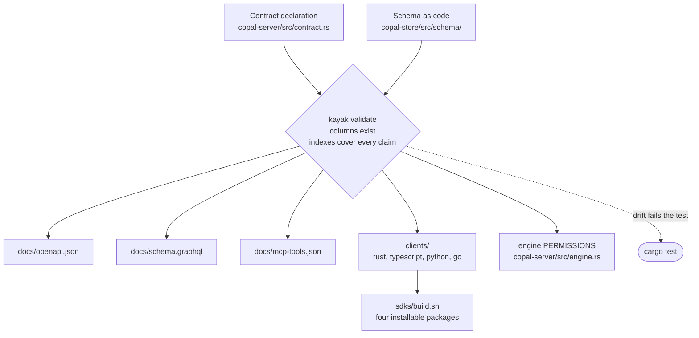
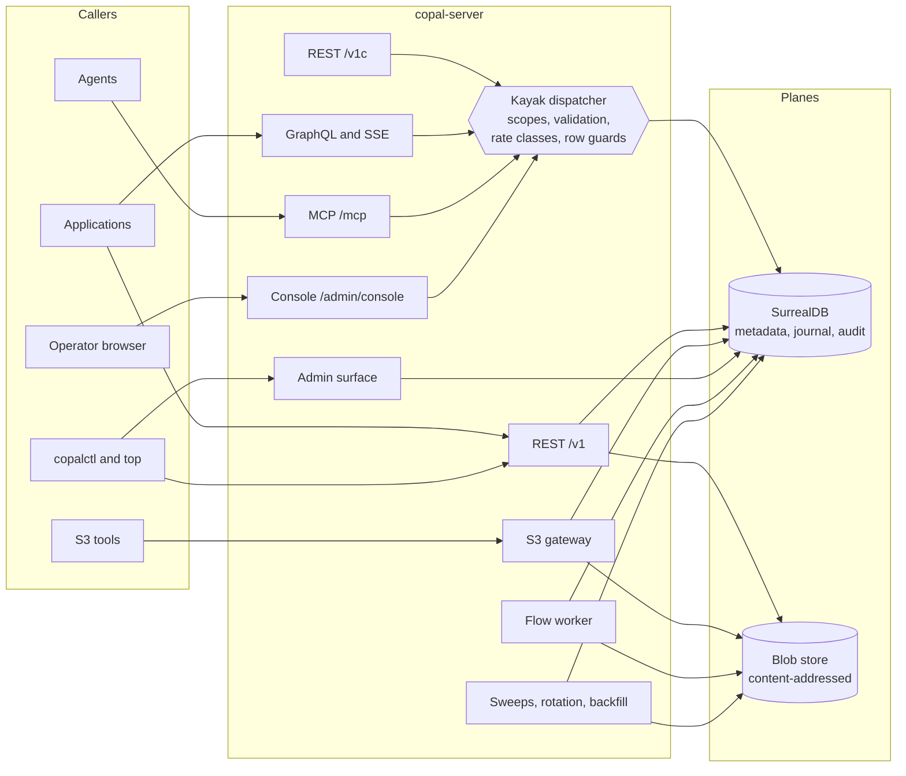
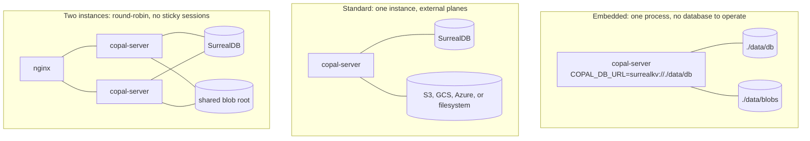
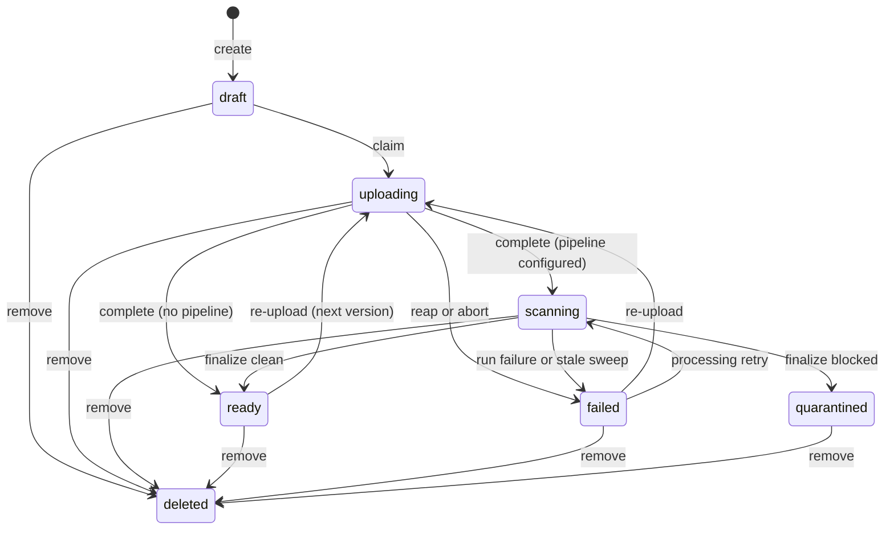

# Architecture

Copal is a self-hosted file service. Metadata, search, access control, the
processing journal, and the audit trail live in one SurrealDB database. File
bytes live behind a content-addressed blob port. One contract declaration
drives every surface a caller can reach.

Sequence-level walkthroughs live in [sequences.md](sequences.md).

## Two clocks

Copal runs on two clocks, and most of its design follows from keeping them
in step.

At **build time** one contract declaration compiles into the documents and
clients that describe the service, validated against the database schema
that backs it. At **run time** the faces callers reach converge on one
dispatcher that enforces the same declaration. A surface cannot drift from
the contract because no surface is written twice.

### Build time: the contract compiles

The contract names tables and columns. Validation resolves it against the
real `surql-rs` schema definitions, including index coverage for every
filter and sort claim, so a query that would become a table scan fails the
build rather than production.

Checked-in artifacts are compared byte for byte by
`crates/copal-server/tests/contract.rs`; `COPAL_BLESS=1` re-blesses them as
a deliberate step. The engine's `PERMISSIONS` are compiled from the same
declaration, so the database enforces tenancy even for a caller holding a
session directly.

### Run time: the faces converge

Four faces render from the contract at run time and dispatch through one
chain: the generated REST face, GraphQL, the MCP tool surface, and the
operator console. The hand-written REST face and the S3 gateway carry
protocol-specific semantics (byte streaming, 201 and 202 shapes, SigV4) and
reach the repositories directly, under the same authentication and the same
engine policy.

## Crates

| Crate | Role |
| --- | --- |
| `copal-core` | Domain types: ids, digests, the file state machine, content sniffing. Pure, no IO. |
| `copal-store` | Metadata plane. Schema as code through `surql-rs`, repositories as free functions, every state change a guarded compare-and-swap. Carries the fleet walk. |
| `copal-blob` | Blob plane. Content-addressed storage behind one port, OpenDAL backends (filesystem, S3, GCS, Azure), staging-then-rename writes, encryption at rest with key rotation. |
| `copal-sign` | Capability tokens: grant tokens (`cg1`), edge tokens (`cg2`), tenant API keys (`ck1`). The store holds hashes only. |
| `copal-flow` | Durable execution: journaled workflow runs over the same database. |
| `copal-server` | Every face: REST, the generated REST twin, GraphQL, MCP, the S3 gateway, the console, the admin surface, plus sweeps and the worker loop. |
| `copal-cli` | `copalctl` and its live view, `copalctl top`. |

Two libraries come from outside the workspace. `oneiriq-kayak` holds the
contract IR, the generators, the differ, and the runtime that dispatches
GraphQL, REST, MCP, and console requests. `oneiriq-surql` holds the
SurrealDB client, the schema-as-code builders, and the reconciliation that
brings a database up to the code's definitions at boot.

## Deployment topologies

The same binary serves all three. Which one a deployment runs is a matter
of configuration.

The embedded tier is single-process by nature, so the two-instance topology
stays on a `ws://` engine. Moving up is pointing a SurrealDB server at the
same surrealkv directory. Leases, claims, and every compare-and-swap resolve
in the engine, which is why round-robin needs no sticky sessions.

## The file state machine

Servability is digest-based. A file serves whenever it has a digest and is not
quarantined, so a re-upload in flight or a running scan
never interrupts the previous content. Quarantine blocks the whole record,
history included.

## Decision records

### One database for metadata and orchestration

**Decision.** Workflow runs, the step journal, coordination leases, grants,
keys, and the audit trail live in the same SurrealDB database as file
metadata. There is no external queue and no workflow engine.

**Rationale.** At-least-once execution plus a unique index on
`(run_key, step_key, attempt)` gives exactly-once recording. Replay reads the
journal, so a crashed worker costs a lease TTL and nothing more. Every additional infrastructure component would add an operational
surface without adding a correctness property the database does not already
provide.

**Implementation.** `copal-flow` claims runs with a CAS lease, executes
registered activity pipelines, and journals each attempt. `workflow_run`,
`workflow_step`, and `service_lease` are ordinary tables defined in
`copal-store/src/schema/flow.rs`.

**Boundaries.** Activities are process-local Rust closures registered at
startup. Definitions-as-data workflows and event-driven dispatch (LIVE SELECT)
are planned, and neither changes the journal model.

### Digest-based servability

**Decision.** Content serves when `digest` is present and state is not
`quarantined`. State alone never decides.

**Rationale.** Lifecycle states describe what is happening to the record.
Bytes that already passed verification stay correct while a re-upload streams
and after a later attempt fails. Tying serving to state
would make every transition a visible outage.

**Implementation.** `FileRecord::servable_content()` is the single check, used
by content routes and grant issuance.

**Boundaries.** A failed current version refuses its own bytes on the version
route (unscanned content). Historical versions that passed their own pipelines
keep serving.

### Stateful capabilities instead of signed URLs

**Decision.** Grant tokens and API keys are database rows. A token is
`prefix.id.secret`; the row stores `sha256(secret)`. There is no signing key.

**Rationale.** A row lookup makes revocation one write, makes use counts
enforceable atomically, and leaves nothing to rotate or leak server-side. A
database leak exposes hashes.

**Implementation.** `copal-sign` mints and parses both families. Verification
is constant-time. Grant redemption consumes a use inside a guarded UPDATE, and
only after every precondition has passed. Unknown ids burn a dummy hash
compare so timing does not reveal key existence.

**Boundaries.** A stateless HMAC mode for CDN-edge verification (`cg2`) is
planned as an addition beside `cg1`.

### Derived reference counts

**Decision.** Garbage collection never increments a counter. Each pass
recomputes a blob's references from live file links and armed version rows.

**Rationale.** Increment bookkeeping drifts under crashes and races. A derived
count is correct by construction on every read.

**Implementation.** The GC sweep walks the blob population in keyset batches,
marks rows whose derived count is zero, and collects after a grace period, row
before object, with a final existence check that aborts collection when
identical content re-registered in the deletion window.

**Boundaries.** The advisory `refcount` column is a cache for operators. No
code path trusts it.

### Contract-first surfaces through Kayak

**Decision.** One `kayak::Contract` object (in `copal-server/src/contract.rs`)
drives the OpenAPI document, the GraphQL SDL, four generated clients, the
live GraphQL endpoint, and the breaking-change gate.

**Rationale.** Hand-maintained API documents drift. Executing the same object
that generates the documents removes the gap: the served schema and the
checked-in artifacts cannot disagree, and the contract tests fail on any
drift between schema, contract, and artifacts.

**Implementation.** GraphQL resolvers are thin closures over the same
repositories the REST handlers use, dispatched through the Kayak runtime with
tenancy as middleware. One wire mapper renders rows for both faces.
`tests/contract.rs` regenerates all six artifacts and compares byte-for-byte.

**Boundaries.** Binary endpoints (upload, download) and the admin surface sit
outside the contract. The drift gate covers them through integration tests
instead.

### Compare-and-swap everywhere

**Decision.** Every state change carries its expected preconditions in the
WHERE clause of the UPDATE that performs it. An empty result means the caller
lost the race.

**Rationale.** Read-then-write sequences race. Putting the guard inside the
write makes the database the serialization point, which holds across any
number of server instances.

**Implementation.** Upload claims, run claims, grant consumption, lease
acquisition, revocations, and state transitions all follow the pattern.
Leases compute expiry server-side (`time::now() + ttl`), so client clocks
cannot extend them.

**Boundaries.** Multi-statement transactions are avoided where a single
guarded UPDATE suffices. Where two writes must cooperate (file flip then run
requeue on retry), the order is chosen so a crash between them self-heals
through a sweep.

## Self-healing inventory

Every stuck state has an automated exit.

| Stuck state | Exit |
| --- | --- |
| Upload claim abandoned by a dead instance | Lease expiry, then the reap sweep moves the file to `failed` (retryable). |
| Run claimed by a dead worker | Lease expiry, then the run reaper returns it to `pending`. Journal replay skips completed steps. |
| File in `scanning` after a pipeline failure | The failed run moves its subject to `failed` at terminal failure. |
| File in `scanning` with no run behind it (crash between complete and enqueue) | The stale-scan sweep fails it after `COPAL_SCAN_STALE_SECS`, unless a pending or running run holds it. |
| Re-upload of identical content whose run already completed | The upload resolves the dedupe in place: the recorded verdict stands and the file finalizes to `ready` immediately. |
| Staging garbage from aborted uploads | The staging sweep deletes entries past their TTL, aged by the ULID in the staging key. |
| Unreferenced blobs | GC mark, grace period, fresh recount, collect. |
| Crash between lease create and arm | An unarmed lease reads as free to the next acquirer. |
