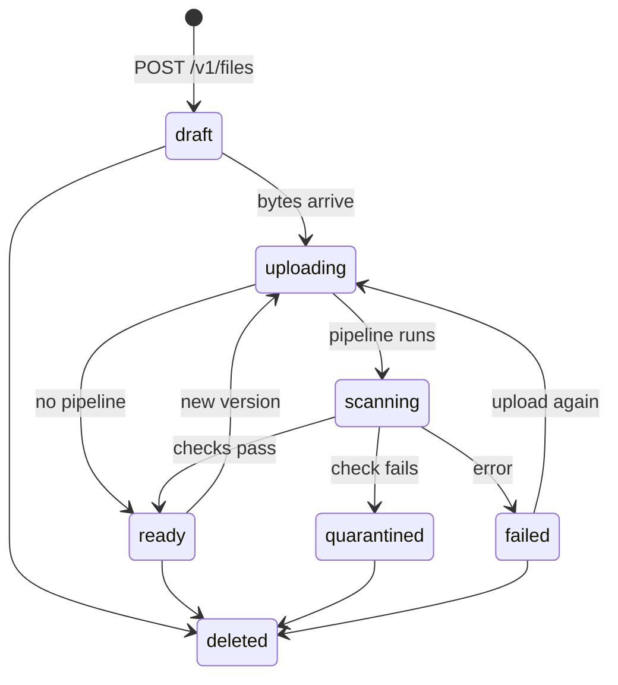

# Getting started

This guide walks through Copal's main features on a local server. The
commands build on each other, so run them in order in one terminal
session. They assume a Unix-style shell with `curl`, `jq`, and `openssl`
(on Windows, Git Bash or WSL works).

If you haven't built Copal yet, follow the [quick start in the
README](../README.md#quick-start) first. You need the `copal-server` and
`copalctl` binaries from `target/release/`.

## Start a server

This starts Copal with the embedded database, API keys required, and the
S3 gateway on port 9000.

```sh
mkdir -p data
[ -f data/blob.key ] || openssl rand -hex 32 > data/blob.key

export COPAL_AUTH_MODE=keys
export COPAL_ADMIN_TOKEN=change-me
export COPAL_DB_URL=surrealkv://./data/db
export COPAL_BLOB_ROOT=./data/blobs
export COPAL_BLOB_ENCRYPTION_KEY=$(cat data/blob.key)
export COPAL_S3_BIND=127.0.0.1:9000

./target/release/copal-server
```

Leave it running and open a second terminal for everything else.

## Create an API key

Every request to the API carries a key, and every key belongs to a
tenant. A tenant is a separate space of files; Copal creates one the first
time you use its name. Keys can be limited to the `read`, `write`, and
`admin` scopes. A key minted with no scopes holds all three.

```sh
export COPAL_URL=http://127.0.0.1:8080
export COPAL_ADMIN_TOKEN=change-me

export COPAL_TOKEN=$(curl -s -X POST $COPAL_URL/v1/admin/tenants/acme/keys \
  -H "x-copal-admin-token: $COPAL_ADMIN_TOKEN" \
  -H 'content-type: application/json' \
  -d '{"name":"getting-started","scopes":["read","write"]}' | jq -r .token)

AUTH="authorization: Bearer $COPAL_TOKEN"
```

The token looks like `ck1.<id>.<secret>`. Copal stores only a hash of it,
so this response is the only time you see it.

## Store a file

A file starts as a record with a path and a content type. Then you send
the bytes with one `PUT`.

```sh
ID=$(curl -s -X POST $COPAL_URL/v1/files -H "$AUTH" \
  -H 'content-type: application/json' \
  -d '{"path":"notes/hello.txt","content_type":"text/plain"}' | jq -r .id)

echo "Copal keeps every version of this file." > hello.txt
curl -s -X PUT $COPAL_URL/v1/files/$ID/content -H "$AUTH" --data-binary @hello.txt | jq .state
```

The `PUT` answers with the file in the `scanning` state. Copal checks the
content type, applies the extension policy, scans for malware if ClamAV is
configured, and extracts text. When that finishes the file is `ready`:

```sh
curl -s $COPAL_URL/v1/files/$ID -H "$AUTH" | jq '{state, size, digest}'
curl -s $COPAL_URL/v1/files/$ID/content -H "$AUTH"
```

These are all the states a file can be in:



A file's `access` field decides who can read its bytes. Set it when you
create the file.

| Access | Who can read the bytes |
| --- | --- |
| `private` (default) | Callers from the owning tenant. |
| `tenant` | Callers from the owning tenant. It is enforced the same way as `private` today. |
| `public` | Anyone, without a key. Served with long-lived cache headers. |
| `grant` | Nobody directly, including the owner. Bytes flow only through signed links. |

## Keep versions

Uploading to the same file again creates a new version. Older versions
stay readable.

```sh
echo "A second version, written later." > hello2.txt
curl -s -X PUT $COPAL_URL/v1/files/$ID/content -H "$AUTH" --data-binary @hello2.txt | jq .version_count

curl -s $COPAL_URL/v1/files/$ID/versions -H "$AUTH" | jq '.items[] | {number, size, created_at}'
curl -s $COPAL_URL/v1/files/$ID/versions/1/content -H "$AUTH"
```

Retention rules and legal holds, which stop versions from being deleted,
are covered in [retention.md](retention.md).

## Search

Copal indexes the text it extracts, so a file is searchable once it is
`ready`:

```sh
curl -s "$COPAL_URL/v1/search?q=versions" -H "$AUTH" | jq '.items[] | {file, excerpt}'
```

Copal reads plain text and JSON itself. For PDFs and office documents,
run an [Apache Tika](https://tika.apache.org) server and point Copal at
it:

```sh
docker run -d -p 9998:9998 apache/tika
export COPAL_EXTRACTOR_ADDR=127.0.0.1:9998
```

Given a bare `host:port`, Copal calls `http://host:port/tika`. A value that
starts with `http://` or `https://` is used exactly as written, so include
the `/tika` path yourself in that form.

### Semantic search

Keyword search finds words. Semantic search finds meaning, so a search for
"kitten nap" can find a note about cats sleeping in the sun. It needs an
embedding service that speaks the OpenAI `/v1/embeddings` API. With
[Ollama](https://ollama.com):

```sh
ollama pull nomic-embed-text
```

Restart the server with one more variable:

```sh
export COPAL_EMBEDDING_ADDR=http://127.0.0.1:11434
./target/release/copal-server
```

The defaults match `nomic-embed-text` (768 dimensions). For another model,
set `COPAL_EMBEDDING_MODEL` and `COPAL_EMBEDDING_DIMENSION` to match it.
Copal embeds new uploads as they arrive and backfills existing files in
the background. Then choose a mode:

```sh
curl -s "$COPAL_URL/v1/search?q=kitten%20nap&mode=semantic" -H "$AUTH" | jq
curl -s "$COPAL_URL/v1/search?q=kitten%20nap&mode=hybrid" -H "$AUTH" | jq
```

`lexical` is the default. `hybrid` blends both rankings. The
[API guide](api.md#search) covers filters, facets, and reranking.

## Share a file

A signed link lets someone download a file without an API key. You choose
how long it lasts and how many times it works.

```sh
GRANT=$(curl -s -X POST $COPAL_URL/v1/files/$ID/url -H "$AUTH" \
  -H 'content-type: application/json' \
  -d '{"ttl_secs":3600,"max_uses":5}')

LINK=$(echo "$GRANT" | jq -r .url)
curl -s $COPAL_URL$LINK
```

The response also carries a `grant_id`. Revoke the link at any time:

```sh
curl -s -X DELETE $COPAL_URL/v1/grants/$(echo "$GRANT" | jq -r .grant_id) -H "$AUTH"
```

The same idea works in the other direction. An upload link lets someone
send you a file without a key:

```sh
INBOX=$(curl -s -X POST $COPAL_URL/v1/files -H "$AUTH" \
  -H 'content-type: application/json' \
  -d '{"path":"inbox/from-partner.txt","content_type":"text/plain"}' | jq -r .id)

UPLOAD=$(curl -s -X POST $COPAL_URL/v1/files/$INBOX/upload-url -H "$AUTH" \
  -H 'content-type: application/json' -d '{"ttl_secs":3600}' | jq -r .url)

# The partner runs this. No key needed.
echo "hello from a partner" | curl -s -X PUT $COPAL_URL$UPLOAD --data-binary @-
```

## Make thumbnails

Copal renders image thumbnails on request. The name in the URL describes
the rendition: kind, width, height, and format (`jpeg` or `png`). The
first request renders it, and later requests serve the stored copy.

```sh
IMG=$(curl -s -X POST $COPAL_URL/v1/files -H "$AUTH" \
  -H 'content-type: application/json' \
  -d '{"path":"images/icon.png","content_type":"image/png"}' | jq -r .id)
curl -s -X PUT $COPAL_URL/v1/files/$IMG/content -H "$AUTH" --data-binary @assets/icon-512.png > /dev/null

curl -s -o thumb.jpg $COPAL_URL/v1/files/$IMG/renditions/thumb-128x128.jpeg -H "$AUTH"
```

To run your own conversions (video frames, audio, document previews),
connect a transformer service. [examples/transformers/ffmpeg](../examples/transformers/ffmpeg/)
is a working one.

## Upload large files with tus

For big files and unreliable networks, `/v1/tus` speaks the
[tus](https://tus.io) resumable upload protocol. Browser libraries such as
tus-js-client and Uppy work with it: point them at
`http://127.0.0.1:8080/v1/tus`, send the `authorization` header, and put
the file's `path` in the upload metadata.

With curl, create a session and then send the bytes:

```sh
LOCATION=$(curl -s -i -X POST $COPAL_URL/v1/tus -H "$AUTH" \
  -H 'Tus-Resumable: 1.0.0' \
  -H "Upload-Length: $(wc -c < hello.txt)" \
  -H "Upload-Metadata: path $(printf 'uploads/big.txt' | base64)" \
  | tr -d '\r' | awk 'tolower($1)=="location:" {print $2}')

curl -s -X PATCH $COPAL_URL$LOCATION -H "$AUTH" \
  -H 'Tus-Resumable: 1.0.0' -H 'Upload-Offset: 0' \
  -H 'Content-Type: application/offset+octet-stream' \
  --data-binary @hello.txt
```

If the connection drops, `HEAD $LOCATION` returns the offset to resume
from.

## Use GraphQL

GraphQL is at `/graphql`. A `GET` returns the schema.

```sh
curl -s -X POST $COPAL_URL/graphql -H "$AUTH" -H 'content-type: application/json' \
  -d '{"query":"{ files(limit: 5) { items { id path state } nextCursor } }"}' | jq
```

Subscriptions arrive as server-sent events. This one prints an event each
time a file becomes ready. Leave it running and upload something from
another terminal.

```sh
curl -N -X POST $COPAL_URL/graphql -H "$AUTH" \
  -H 'content-type: application/json' -H 'accept: text/event-stream' \
  -d '{"query":"subscription { eventChanged(action: \"file.ready\") { id action payload created_at } }"}'
```

The same events are available as a list at `GET /v1/events`.

## Connect an AI agent

`/mcp` is a Model Context Protocol server that gives an agent tools to
list, read, create, share, and search files, using the same key and scopes
as the API. To add it to Claude Code:

```sh
claude mcp add --transport http copal http://127.0.0.1:8080/mcp \
  --header "Authorization: Bearer $COPAL_TOKEN"
```

Or add it to a project's `.mcp.json`, reading the token from the
environment:

```json
{
  "mcpServers": {
    "copal": {
      "type": "http",
      "url": "http://127.0.0.1:8080/mcp",
      "headers": { "Authorization": "Bearer ${COPAL_TOKEN}" }
    }
  }
}
```

To see the tools without an agent:

```sh
curl -s -X POST $COPAL_URL/mcp -H "$AUTH" -H 'content-type: application/json' \
  -d '{"jsonrpc":"2.0","id":1,"method":"tools/list"}' | jq '.result.tools[].name'
```

## Use S3 tools

The S3 gateway lets existing tools read and write Copal storage. Each
tenant is a bucket, and each file path is an object key. Uploads through
S3 go through the same pipeline, versioning, and events as the API.

S3 credentials are separate from API keys. Mint a pair for the tenant; the
secret is shown once:

```sh
curl -s -X POST $COPAL_URL/v1/admin/tenants/acme/s3-credentials \
  -H "x-copal-admin-token: $COPAL_ADMIN_TOKEN" | jq
```

Then use them with the AWS CLI (any region name works):

```sh
export AWS_ACCESS_KEY_ID=<access_key_id>
export AWS_SECRET_ACCESS_KEY=<secret_access_key>
export AWS_DEFAULT_REGION=us-east-1

aws --endpoint-url http://127.0.0.1:9000 s3 ls s3://acme/ --recursive
aws --endpoint-url http://127.0.0.1:9000 s3 cp report.pdf s3://acme/reports/report.pdf
aws --endpoint-url http://127.0.0.1:9000 s3 sync ./photos s3://acme/photos
```

With rclone, configure a remote of type `s3` with provider `Other` and
endpoint `http://127.0.0.1:9000`. With the MinIO client:

```sh
mc alias set copal http://127.0.0.1:9000 <access_key_id> <secret_access_key>
mc ls copal/acme
```

Copal's ETag is the file's SHA-256 digest, where S3 uses MD5. Tools that
compare checksums by ETag see every object as changed, so compare by size
instead (for rclone, `--size-only`). The [API guide](api.md#s3-gateway)
lists the supported operations.

## Get notified with webhooks

Webhooks deliver an HTTP `POST` when a file becomes `ready`,
`quarantined`, `failed`, or `deleted`. Registering one needs a key with
the `admin` scope, and the server must have an encryption key.

```sh
ADMIN_KEY=$(curl -s -X POST $COPAL_URL/v1/admin/tenants/acme/keys \
  -H "x-copal-admin-token: $COPAL_ADMIN_TOKEN" -H 'content-type: application/json' \
  -d '{"name":"hooks","scopes":["admin"]}' | jq -r .token)

curl -s -X POST $COPAL_URL/v1/webhooks -H "authorization: Bearer $ADMIN_KEY" \
  -H 'content-type: application/json' \
  -d '{"url":"https://example.com/copal-hook","events":["file.ready"]}' | jq
```

The response includes a signing `secret`, shown once. Each delivery
carries `x-copal-signature: sha256=<hex>`, an HMAC-SHA256 of the raw
request body. The HMAC key is the secret string exactly as returned: use
its UTF-8 bytes as they are, without hex-decoding it. In Python:

```python
import hashlib, hmac

def verify(secret: str, body: bytes, header: str) -> bool:
    expected = "sha256=" + hmac.new(secret.encode(), body, hashlib.sha256).hexdigest()
    return hmac.compare_digest(expected, header)
```

Deliveries retry with backoff for up to eight attempts, and a delivery can
arrive more than once, so dedupe on the event `id`. Copal refuses webhook
URLs on private or loopback addresses unless you set
`COPAL_WEBHOOK_ALLOW_PRIVATE_TARGETS=true`.

## Administer

A principal is a named actor inside a tenant: a person, a service, or an
agent. Keys minted under a principal can never exceed its scopes, and
disabling the principal disables its keys.

```sh
curl -s -X POST $COPAL_URL/v1/admin/tenants/acme/principals \
  -H "x-copal-admin-token: $COPAL_ADMIN_TOKEN" -H 'content-type: application/json' \
  -d '{"handle":"backup-bot","kind":"service","scopes":["read"]}'

curl -s -X POST $COPAL_URL/v1/admin/tenants/acme/keys \
  -H "x-copal-admin-token: $COPAL_ADMIN_TOKEN" -H 'content-type: application/json' \
  -d '{"name":"nightly","principal":"backup-bot"}' | jq -r .token
```

Other admin tools:

- The console at <http://127.0.0.1:8080/admin/console>. Sign in with any
  username and the admin token as the password.
- `copalctl top` for a live view of tenants and the audit trail.
- `curl -H "x-copal-admin-token: $COPAL_ADMIN_TOKEN" $COPAL_URL/metrics`
  for Prometheus metrics.
- `GET /v1/admin/tenants/acme/audit` for a tenant's audit trail.

## Next steps

- [operations.md](operations.md) has every setting and the production
  checklist.
- [api.md](api.md) covers each endpoint family in depth.
- [backup.md](backup.md) explains what to back up and how to restore it.
- [migration.md](migration.md) shows how to move an existing S3 bucket into
  Copal.
