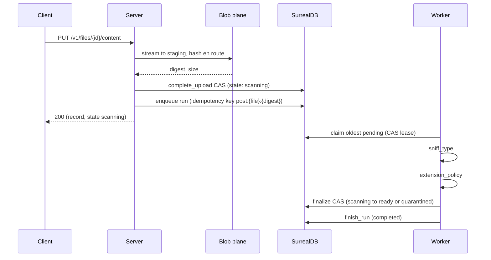

# Processing

Copal executes workflows inside the database it already runs on. A workflow is
an ordered pipeline of activities. An activity is an async Rust function from
JSON to JSON, registered at startup, idempotent by contract. The engine
provides durability; activities provide behavior.

## The journal model

Every run is a `workflow_run` row. Every activity attempt is a
`workflow_step` row. A unique index on `(run_key, step_key, attempt)` makes
recording exactly-once even though execution is at-least-once: a step that
already completed replays from its recorded output and the activity does not
run again.



Claims are leases. A worker that dies mid-run holds its claim until the lease
expires, then the run reaper returns the run to `pending` and the next worker
replays the journal. The cost of a crash is one lease TTL.

## The standard upload pipeline

Three activities, registered by `standard_registry`:

1. `sniff_type` reads the first bytes by digest and records the sniffed
   content type next to the declared one. Unverifiable content records a
   match, because absence of evidence is not a lie.
2. `extension_policy` checks the path against the blocked-extension denylist.
   With `COPAL_ENFORCE_TYPE_MATCH` set, a sniffed type that contradicts the
   declared type also blocks.
3. `finalize_upload` moves the file from `scanning` to `ready` or
   `quarantined` in one CAS, writing the verdict under
   `metadata.processing` atomically with the transition. Losing the CAS on
   replay is the idempotent outcome.

The run key is deterministic (`post:{file id}:{digest}`), so a crashed or
repeated enqueue folds into the original run. When a re-upload of
identical content hits a run that already completed, the upload resolves it in
place: the recorded verdict stands and the file finalizes immediately.

## Failure and recovery

A run that fails terminally (a step exhausted its attempts) moves its subject
file from `scanning` to `failed` in the same breath. The file keeps its
digest, so previously verified content keeps serving.

Recovery is `POST /v1/runs/{id}/retry`. The guardrails:

1. Only failed runs retry. Anything else answers 409.
2. A run whose recorded digest no longer matches the file refuses; a newer
   upload superseded it.
3. The subject file flips `failed` to `scanning` before the run returns to
   `pending`. The reverse order would let a worker finalize against a
   still-failed file.
4. Each remaining step gets one fresh attempt per retry. Journaled attempts
   keep counting toward the ceiling.

Files stuck in `scanning` with no live run behind them (a crash between
completion and enqueue) are failed by the stale-scan sweep after
`COPAL_SCAN_STALE_SECS`. A pending or running run shields its file from that
sweep regardless of age, so long scans are safe.

## Writing your own workflows

```rust
let registry = FlowRegistry::new()
    .activity("resize", |input| async move {
        // input is the previous step's output (or the run input)
        Ok(serde_json::json!({ "resized": true, "source": input }))
    })
    .workflow("thumbnail", &["resize"], 3);

let state = AppState::new(store, blobs).with_flow(registry);
```

Rules that keep replay honest:

1. Activities must be idempotent. Replay after a crash re-executes any step
   whose completion was not journaled.
2. Side effects belong behind guarded writes. The finalize pattern (CAS with
   the expected state in the WHERE clause) makes a replayed effect lose
   harmlessly.
3. Output of step N is input of step N+1. Thread context through the JSON.

Start runs over the API (`POST /v1/runs`, the `runStart` mutation) or from
code through `FlowEngine::enqueue`. Sync mode (`mode: "sync"`) executes
in-request over the same journal. Durability is identical; the
only difference is who waits.
