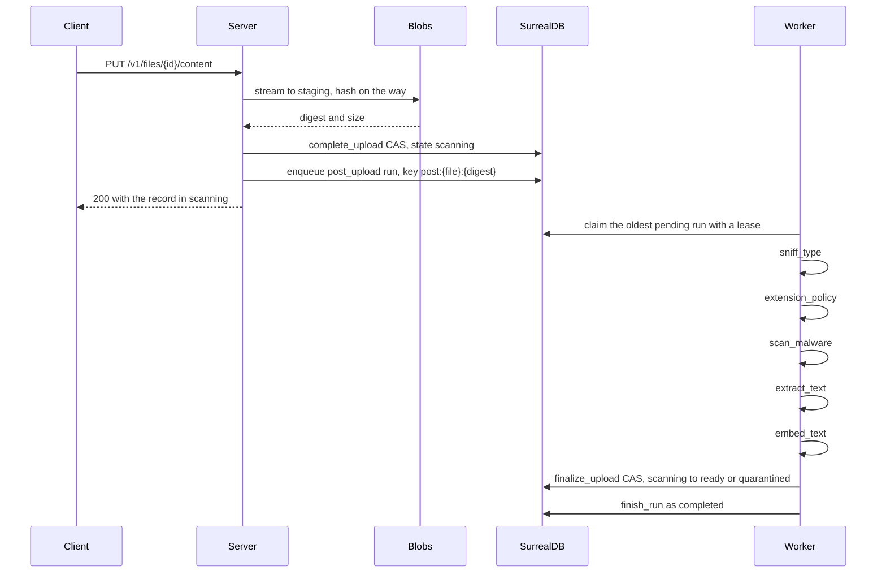

# Processing

Copal runs workflows inside the database it already uses. A workflow
is an ordered list of activities. An activity is an async Rust
function from JSON to JSON, registered at startup, and idempotent by
contract. The flow engine (`copal-flow`) provides durability, and the
activities provide behavior.

## The journal model

Every run is a `workflow_run` row. Every activity attempt is a
`workflow_step` row. A unique index on `(run_key, step_key, attempt)`
makes recording exactly-once even though execution is at-least-once:
a step that already completed replays from its recorded output, and
the activity does not run again.



Claims are leases. A worker that dies mid-run holds its claim until
the lease expires. Then the run reaper returns the run to `pending`,
and the next worker replays the journal. A crash costs one lease TTL.

The server starts one worker loop per process, and it executes one run
at a time. A step's retries happen inside that run, back to back.
Every instance in a fleet claims runs from the same table, and the
claim compare-and-swap keeps two workers off one run.

## The upload pipeline

The server registers six activities as the `post_upload` workflow.
Every upload face (the REST PUT, tus, the S3 gateway, upload grants,
URL fetches, and external transforms) enqueues it when content lands.
Each step gets up to three attempts.

1. `sniff_type` reads the first bytes by digest and records the
   sniffed content type next to the declared one. Unrecognized content
   records a match, because a type that cannot be verified is not a
   contradiction.
2. `extension_policy` checks the path against the blocked-extension
   denylist (`COPAL_BLOCKED_EXTENSIONS`, or the built-in list). With
   `COPAL_ENFORCE_TYPE_MATCH=true`, a sniffed type that contradicts the
   declared type also blocks.
3. `scan_malware` streams the content to clamd when `COPAL_CLAMAV_ADDR`
   is set. A detection blocks with the signature as the reason. An
   unreachable scanner is an error, so the step retries. Without a
   scanner the step records `scanned: false`. Content already blocked
   by an earlier step is not scanned.
4. `extract_text` pulls text from the content. Text and JSON decode
   natively; other formats go to the extractor at
   `COPAL_EXTRACTOR_ADDR`. Upload markers resolve here, and the text is
   split into passages for search. Blocked content is never opened.
5. `embed_text` embeds every passage that still lacks a vector, when
   `COPAL_EMBEDDING_ADDR` is set.
6. `finalize_upload` moves the file from `scanning` to `ready`, or to
   `quarantined` when any step blocked it, in one compare-and-swap.
   The verdicts land under `metadata.processing` in the same write.
   Losing the compare-and-swap on replay is the idempotent outcome.

The run key is deterministic (`post:{file id}:{digest}`), so a crashed
or repeated enqueue folds into the original run. When a re-upload of
identical content meets a run that already completed, the upload
resolves it in place: the recorded verdict stands and the file
finalizes immediately.

[operations.md](operations.md) covers what each external service
expects and how scanning changes serving.

## Other built-in workflows

| Workflow | Steps | Started by |
| --- | --- | --- |
| `derive` | `render_rendition` | `POST /v1/files/{id}/renditions`. Decodes an image source and finishes the derived file. A rendition URL that misses renders inside the request instead, without a run. |
| `transform` | `transform_external` | `POST /v1/files/{id}/transform`. Sends the source to an operator-configured transformer and finishes the derived file with the answer, which then runs `post_upload`. |
| `fetch` | `fetch_source` | `POST /v1/files/fetch`. Pulls bytes from a URL into the new record, which then runs `post_upload`. |
| `tier.recall` | `tier_restore_request`, `tier_await_readable`, `tier_recall_promote` | A byte read that finds its content in an archive-class tier. Issues the restore, polls until the object reads, and copies it home. |

`derive`, `transform`, and `fetch` allow three attempts per step. The
recall's polling step allows up to 600 attempts, 15 seconds apart,
which bounds one recall run at about two and a half hours. Because the
worker runs one run at a time, a recall that waits on a slow archive
restore occupies its instance's worker for that whole wait.

## Failure and recovery

A run that fails terminally (a step used all its attempts) moves its
subject file from `scanning` to `failed` at the same time. The file
keeps its digest, so previously verified content keeps serving.

Recovery is `POST /v1/runs/{id}/retry`. The rules:

1. Only failed runs retry. Anything else answers 409.
2. A run whose recorded digest no longer matches the file refuses; a
   newer upload replaced it.
3. The subject file flips from `failed` to `scanning` before the run
   returns to `pending`. The reverse order would let a worker finalize
   against a file that is still `failed`.
4. Each remaining step gets one fresh attempt per retry. Journaled
   attempts still count toward the ceiling.

Files stuck in `scanning` with no live run behind them (a crash
between completion and enqueue) are failed by the stale-scan sweep
after `COPAL_SCAN_STALE_SECS`. A pending or running run shields its
file from that sweep regardless of age, so long scans are safe.

## Writing your own workflows

Register activities and workflows on a `FlowRegistry`, and hand it to
the application state:

```rust
let registry = FlowRegistry::new()
    .activity("resize", |input| async move {
        // input is the previous step's output, or the run input
        Ok(serde_json::json!({ "resized": true, "source": input }))
    })
    .workflow("thumbnail", &["resize"], 3);

let state = AppState::new(store, blobs).with_flow(registry);
```

The last argument to `workflow` is the attempt ceiling per step.

Rules that keep replay correct:

1. Activities must be idempotent. Replay after a crash re-executes any
   step whose completion was not journaled.
2. Side effects belong behind guarded writes. The finalize pattern (a
   compare-and-swap with the expected state in the WHERE clause) makes
   a replayed effect lose without harm.
3. The output of step N is the input of step N+1. Carry context
   through the JSON.

Start runs by workflow name over the API (`POST /v1/runs`, the
`runStart` mutation, or the `run_start` MCP tool) or from code through
`FlowEngine::enqueue`. Sync mode (`mode: "sync"`) executes in the
request over the same journal. Durability is identical; the only
difference is who waits.
