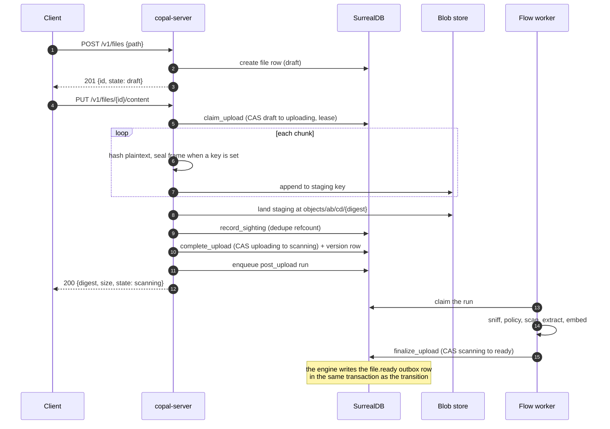
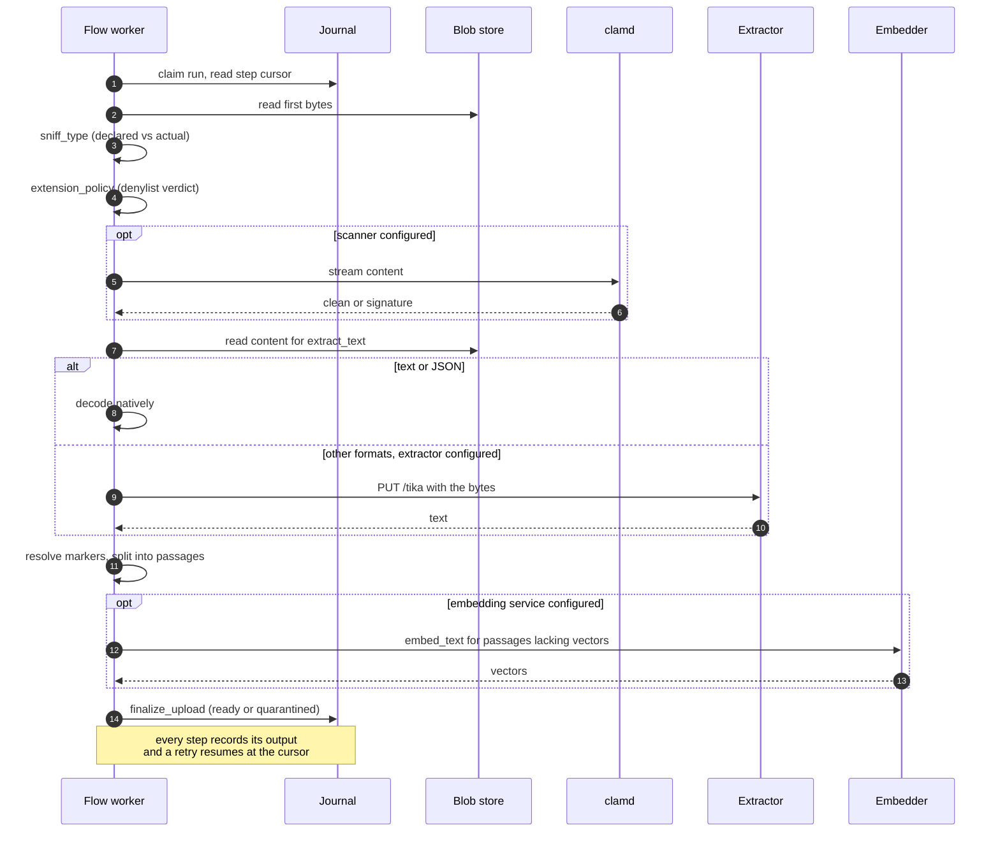
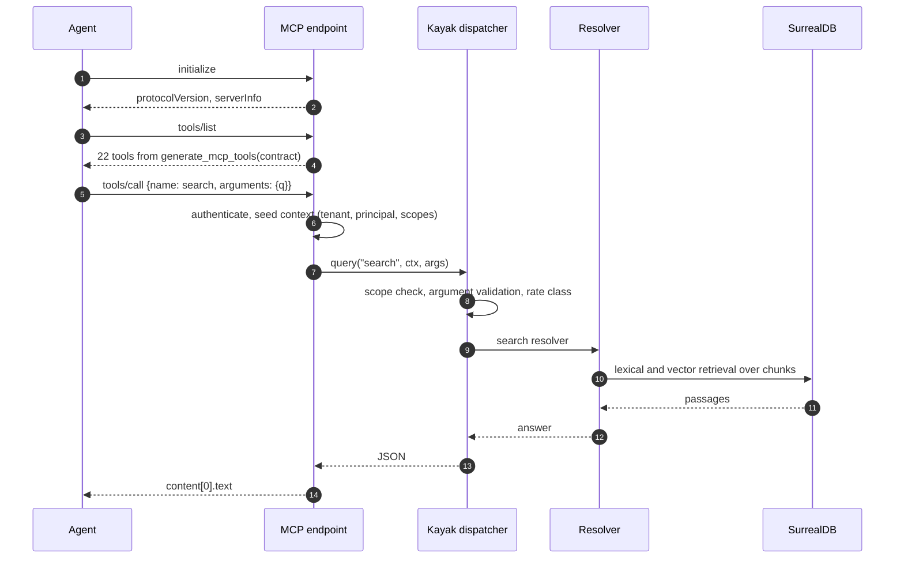
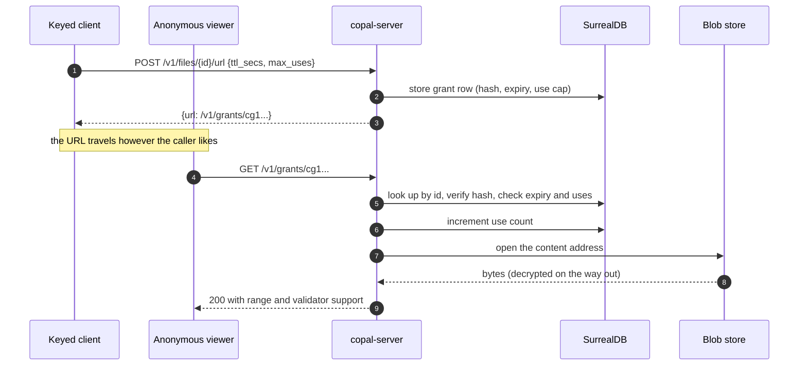
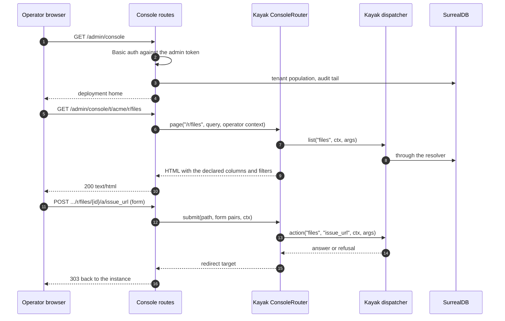
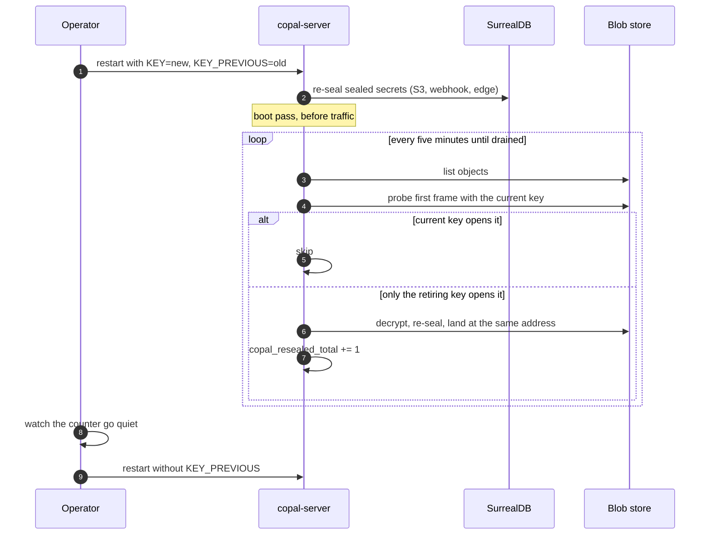
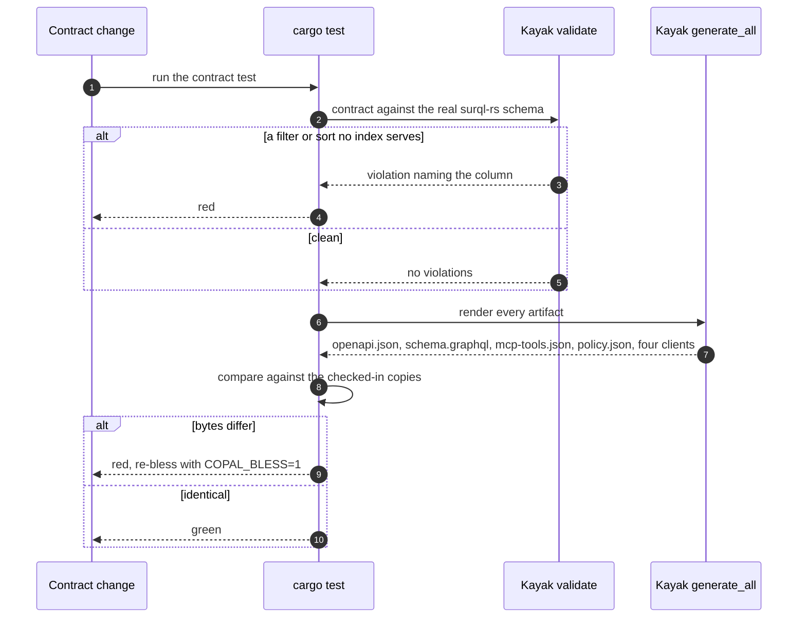

# Sequences

How the pieces behave over time. Every diagram here traces code that
runs; the file and function names are where to look next.

## Upload, end to end

Two calls from the client, and the record walks its state machine. The
claim lands before any byte, so a second uploader loses a
compare-and-swap instead of interleaving writes. The digest accumulates
while bytes stream, which is why the content address cannot be known
until the last byte.

The record serves as soon as it has a digest, so a running scan never
blinks a previous version. Quarantine is the one verdict that blocks
the whole record.

## The post-upload pipeline

One journaled run, six activities, each one's output the next one's
input. Activities are idempotent by construction, so replay after a
crash is safe: sniffing and policy are pure over immutable content, and
the finalize compare-and-swap loses harmlessly on a repeat.

## An agent through MCP

The tool manifest is generated from the contract, so an agent's tools
are the API's operations. The call path is the same dispatcher the
other contract faces use, which is why an agent cannot reach anything
a key could not.

## A signed URL

Grants are stateful capabilities. The row holds a hash, so revocation
is one write and there is no signing key to leak. Redemption carries no
tenant identity, which is what makes the URL shareable.

## The operator console

A browser has no admin header, so the console takes the admin token as
the Basic password. Pages and forms run the same dispatcher, so what
the console shows is what the API would answer.

## Master key rotation

Content addressing makes the sweep safe in place: the digest covers
plaintext, so a re-sealed object keeps its address and every reference
to it.

Reads work throughout: every open probes the current key first and
falls back once, so a drained rotation costs nothing on the read path.

## Where a contract change goes

The gate is a test. A declaration edit that disagrees with the database
schema, or that would change a generated artifact without blessing it,
fails in CI with the offending name.

